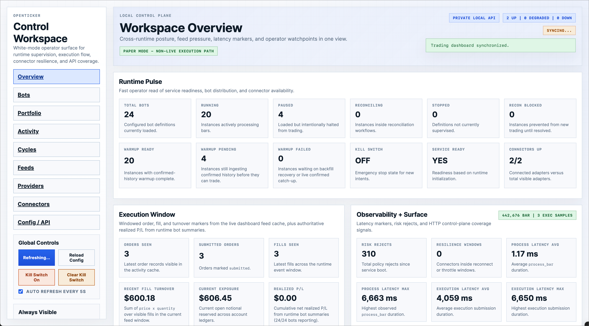
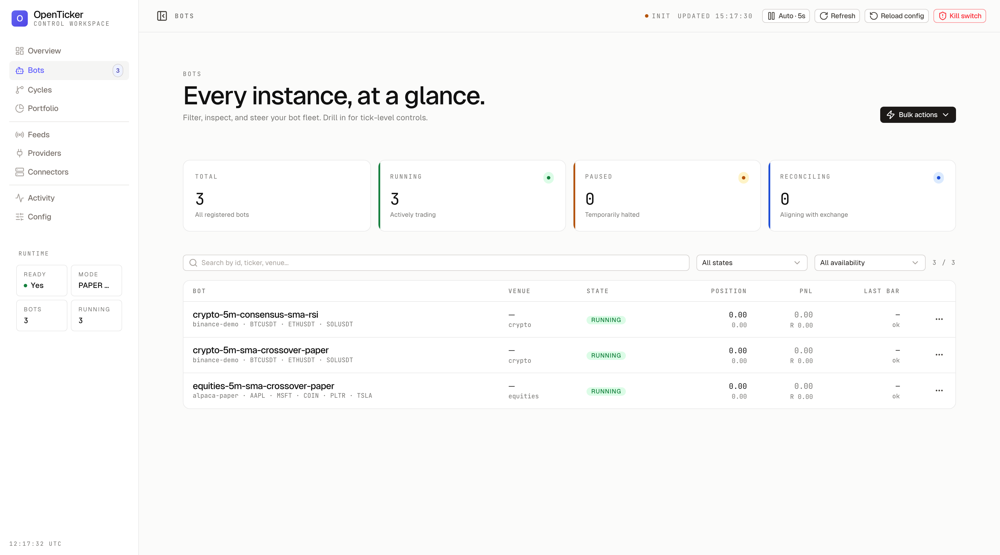
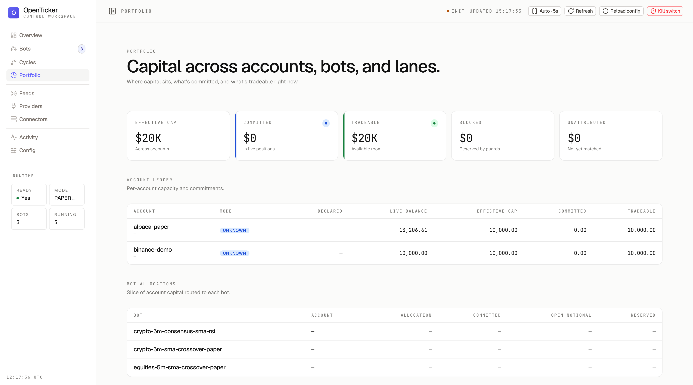
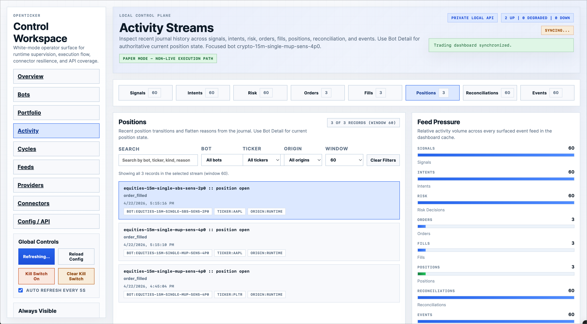
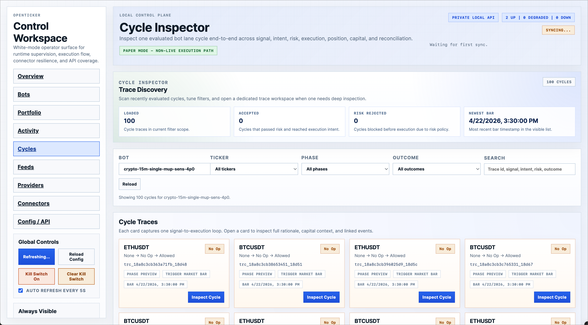
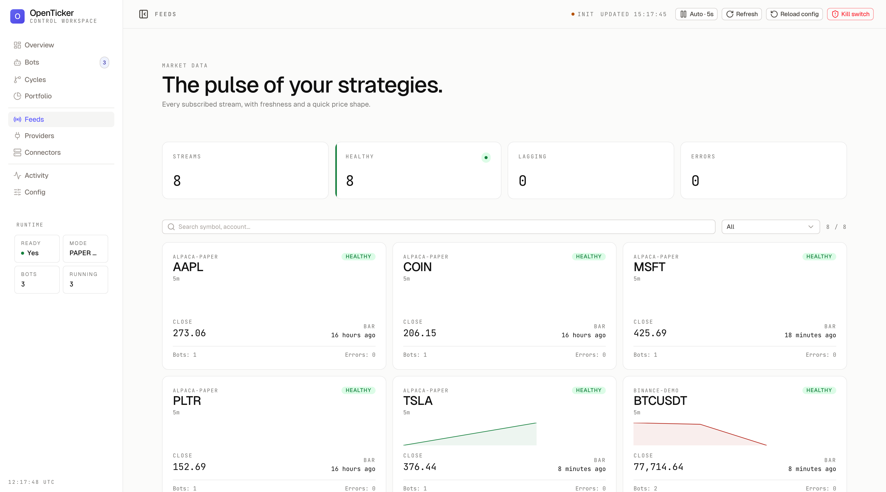
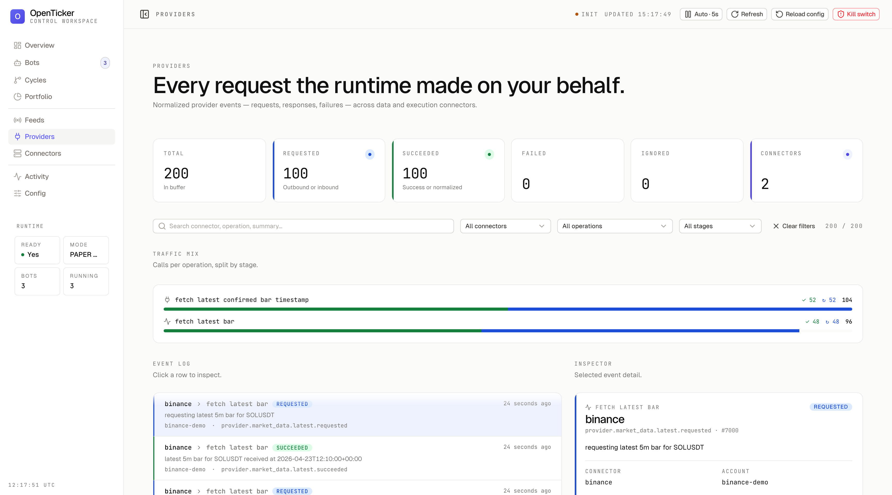
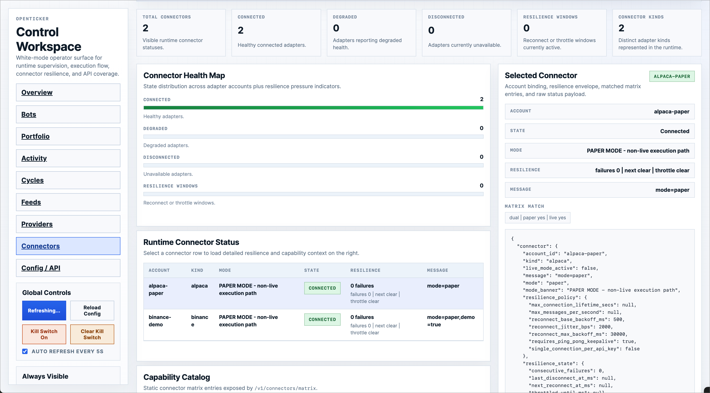
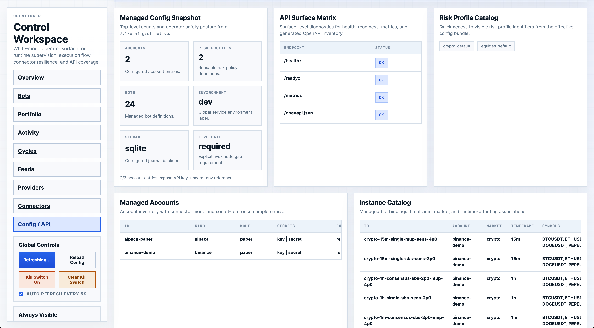

# OpenTicker

OpenTicker is a multi-crate Rust workspace for configurable spot-trading runtime orchestration across equities and crypto.

The project includes:

- a long-running runtime and reconciliation loop
- connector-backed market data and execution abstractions
- an Axum HTTP control plane
- a CLI and Ratatui dashboard
- TOML-based deployment config
- SQLite-backed journaling and recovery

## Dashboard

The local control plane surfaces runtime state across nine focused workspaces.

### Workspace Overview

Cross-runtime posture, feed pressure, latency markers, and operator watchpoints in one view.



### Bots

Per-bot runtime readiness, venue binding, position, and P/L across every configured instance.



### Portfolio

Ledger-backed account, bot, and lane ownership with explicit cap, commitment, blocked room, and tradable room semantics.



### Activity Streams

Recent journal history across signals, intents, risk, orders, fills, positions, reconciliations, and events.



### Cycle Inspector

End-to-end trace of one evaluated bot lane cycle across signal, intent, risk, execution, position, capital, and reconciliation.



### Dataplane Feeds

Registered ticker streams, buffer freshness, attached bots, in-memory dataplane bars, and on-demand connector history.



### Providers

Request volume, provider event log, and raw request/response payloads at the runtime/provider boundary.



### Connectors

Adapter state distribution, resilience pressure, and per-account connector capability context.



### Config / API

Managed config snapshot, API surface matrix, risk profile catalog, managed accounts, and the full instance catalog.



## Repository Layout

- `crates/`: workspace crates with explicit boundaries
- `config/`: local config, templates, and example bot definitions
- `Makefile`: common workspace commands
- `.github/workflows/ci.yml`: CI entrypoint

## Included OSS Indicators

The open-source build currently ships two generic built-in indicators:

- `sma_crossover`: a standard fast-vs-slow simple moving average crossover signal
- `rsi_threshold`: a standard RSI threshold filter/context signal

These are enough to exercise the full config, runtime, strategy, HTTP, and test surfaces without carrying private indicator names forward.

Additional indicator descriptors live in the `openticker-indicators` crate and are compiled in only when the `indicators` Cargo feature is enabled (see [Build Features](#build-features)). Bot configs that reference those indicator types will fail validation with `unsupported indicator type` on a build without the feature.

## Workspace Crates

- `openticker-core`: shared domain types
- `openticker-config`: config schema, loading, validation, and effective-config output
- `openticker-registry`: build-specific catalog and engine construction surface
- `openticker-indicators`: extension hook crate for private indicator packs
- `openticker-instance`: config-driven indicator and strategy assembly
- `openticker-signals`: indicator contracts, shared math helpers, and built-in default/example indicators
- `openticker-strategy`: signal-to-intent mapping
- `openticker-risk`: pure risk policy
- `openticker-data`: normalized market-data helpers
- `openticker-dataplane`: stream registry, polling scheduler, and in-memory bar retention
- `openticker-execution`: venue-neutral execution contracts
- `openticker-gateway`: runtime-facing connector facade
- `openticker-ledger`: capital ownership and reservations
- `openticker-portfolio`: account-level ownership and reconciliation helpers
- `openticker-storage`: journal abstraction and storage backends
- `openticker-trace`: tracing and observability helpers
- `openticker-connectors`: venue adapters and connector registry
- `openticker-lane`: extracted per-lane runtime state and helpers
- `openticker-runtime`: composition root and lifecycle orchestration
- `openticker-http`: Axum control plane
- `openticker-cli`: operator CLI and dashboard
- `openticker-testkit`: reusable deterministic test helpers

## Quick Start

1. Install the stable Rust toolchain.
2. Copy `config/.env.example` to `.env` and set your connector environment variables.
3. Review `config/openticker.toml`, `config/accounts/*.toml`, `config/risk/*.toml`, and one of the example bot files under `config/bots/`.
4. Validate the config.

```bash
cargo run -p openticker-cli -- validate-config --config-dir config
```

5. Start the service.

```bash
cargo run -p openticker-cli -- service run --config-dir config
```

6. Open the dashboard in another terminal if needed.

```bash
cargo run -p openticker-cli -- dashboard
```

## Build Features

OpenTicker uses a Cargo feature to gate the private indicator pack shipped in `openticker-indicators`. Features are resolved at compile time — there is no runtime toggle.

- **OSS build (default):** only `sma_crossover` and `rsi_threshold` are registered.
- **With `indicators`:** every descriptor exposed by `openticker-indicators::indicator_descriptors()` is registered alongside the OSS ones.

Enable it however you build:

```bash
# Local
cargo build --release -p openticker-cli --features indicators
cargo run -p openticker-cli --features indicators -- validate-config --config-dir config

# Docker (direct)
docker build --build-arg OPENTICKER_FEATURES=indicators -t openticker .

# docker compose — via shell env or .env at the repo root
OPENTICKER_FEATURES=indicators docker compose build
```

Leave `OPENTICKER_FEATURES` unset (or empty) for the pure OSS build.

## Config Layout

The active on-disk layout is:

- `config/openticker.toml`
- `config/accounts/*.toml`
- `config/risk/*.toml`
- `config/bots/*.toml`

Each bot binds together:

- market and symbols
- timeframe
- account
- data connector
- execution connector
- strategy
- signal mode
- one or more indicator instances
- optional warmup override
- execution constraints
- risk profile

## Commands

Workspace commands:

- `make fmt`
- `make fmt-check`
- `make check`
- `make build`
- `make test`
- `make lint`
- `make clippy`
- `make fix`
- `make ci`

Direct cargo equivalents:

- `cargo check --workspace`
- `cargo build --workspace`
- `cargo test --workspace`
- `cargo lint`
- `cargo clippy --workspace --all-targets --all-features`

## Current State

- The workspace is crate-separated, but some crates are still internally monolithic.
- `openticker-runtime` remains the largest concentration of orchestration logic.
- `openticker-config` still carries some connector capability knowledge that overlaps with `openticker-connectors`.
- The public repository intentionally excludes internal planning docs, private indicator source material, and local agent tooling.

## Disclaimer

OpenTicker is an open-source software project published by Aether Holdings in connection with its work in stocks, trading, AI, and intelligence. It is provided for development, research, testing, and educational use only.

Nothing in this repository is financial, investment, legal, tax, or compliance advice, or an offer, solicitation, or recommendation to buy, sell, or hold any asset.

Trading and investing involve substantial risk, including the risk of total capital loss. If you use this software, you do so at your own risk and are responsible for strategy validation, paper testing, operational safeguards, and compliance with all applicable laws and venue or broker rules.

For the full statement, see [`DISCLAIMER.md`](DISCLAIMER.md).
