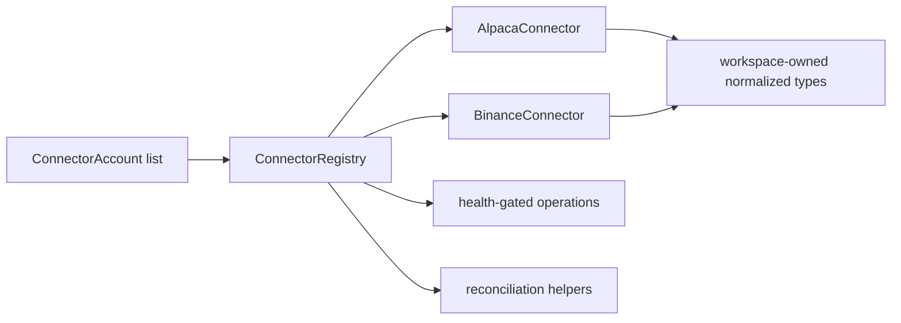

# ARCHITECTURE

Last reviewed: 2026-04-18

## Role

`openticker-connectors` is the venue-integration boundary for the workspace.

It owns:

- connector capability metadata
- per-account connector construction
- health and resilience state
- latest-bar and recent-bar fetches
- account snapshot and position/open-order reads
- execution submission
- market-stream and private-stream normalization
- symbol constraint lookup

Its core architectural rule is that raw venue behavior must be normalized into OpenTicker-owned types before values leave the crate.

## Entry Surface

Important shared types:

- `ConnectorKind`
- `ConnectorRole`
- `ConnectionState`
- `ConnectorDescriptor`
- `ConnectorResiliencePolicy`
- `ConnectorResilienceState`
- `ConnectorStatus`
- `ConnectorAccount`
- `ConnectorAccountStatus`
- `ConnectorAccountSnapshot`
- `ConnectorOpenOrder`
- `ConnectorPosition`
- `ConnectorSymbolConstraints`
- `ConnectorPrivateStreamEvent`
- `ConnectorPrivateAccountEvent`
- `ConnectorPrivateBalance`
- `ConnectorError`

Important traits:

- `ConnectorHealth`
- `ConnectorReconcile`
- `ConnectorMarketData`
- `ConnectorExecution`
- `ConnectorSymbolConstraintsLookup`
- `ConnectorMarketStream`
- `ConnectorPrivateStream`
- `ConnectorRuntimeControl`

Primary public entrypoints:

- `ConnectorRegistry::from_accounts(...)`
- `ConnectorRegistry` checked operational methods
- `ConnectorRegistry` unchecked reconciliation helpers
- `descriptor_for(...)`
- `connector_matrix()`

Concrete adapters:

- `AlpacaConnector` in `src/connectors/alpaca/connector.rs`
- `BinanceConnector` in `src/connectors/binance/connector.rs`

## Internal Layout

| Path | Responsibility |
| --- | --- |
| `src/lib.rs` | Crate entrypoint and re-export surface |
| `src/types.rs` | Shared connector domain types and DTOs |
| `src/traits.rs` | Shared connector trait contracts |
| `src/error.rs` | Connector error surface |
| `src/capabilities.rs` | Connector capability descriptors and matrix |
| `src/helpers.rs` | Shared utility helpers and credential/runtime-safe HTTP helpers |
| `src/stub.rs` | Stub connector behavior and trait implementations |
| `src/registry.rs` | Account-keyed registry and operational dispatch |
| `src/tests.rs` | Crate-level tests for shared behavior |
| `src/connectors/alpaca/mod.rs` | Alpaca module wiring and connector re-export |
| `src/connectors/alpaca/connector.rs` | Alpaca connector and trait implementations |
| `src/connectors/alpaca/account.rs` | Account payload and snapshot normalization |
| `src/connectors/alpaca/bars.rs` | Historical-bar payloads and normalization |
| `src/connectors/alpaca/orders.rs` | Order payload and acceptance helpers |
| `src/connectors/alpaca/http.rs` | REST response decoding |
| `src/connectors/alpaca/de.rs` | Alpaca decimal deserializers |
| `src/connectors/alpaca/tests.rs` | Alpaca adapter unit tests |
| `src/connectors/binance/mod.rs` | Binance module wiring and connector re-export |
| `src/connectors/binance/connector.rs` | Binance connector and trait implementations |
| `src/connectors/binance/snapshot.rs` | Account, open-order, and exchange-info normalization |
| `src/connectors/binance/klines.rs` | Kline parsing and confirmed-bar normalization |
| `src/connectors/binance/orders.rs` | Order submission, status, quantity, and fee helpers |
| `src/connectors/binance/stream.rs` | Market/private websocket normalization and preview worker |
| `src/connectors/binance/http.rs` | HMAC signing and REST response decoding |
| `src/connectors/binance/de.rs` | Binance decimal deserializers |
| `src/connectors/binance/tests.rs` | Binance adapter unit tests |

Current layout now groups venue adapters under `src/connectors/`, while shared crate internals live in top-level focused modules.

## Direct Dependency Wiring

Workspace dependencies:

| Crate | Used For |
| --- | --- |
| `openticker-core` | Core bar, timeframe, signal-phase, and execution-mode types |
| `openticker-data` | Normalized stream and order-event output types |
| `openticker-execution` | Normalized execution request/accepted-order contract and paper-router reuse |

## Inbound Wiring

Primary consumers:

- `openticker-runtime` constructs `ConnectorAccount` values from config and builds `ConnectorRegistry`
- `openticker-runtime` uses the registry for polling, stream normalization, account snapshots, symbol constraints, reconciliation, and order submission
- `openticker-http` exposes `connector_matrix()` as capability metadata

## Outbound Wiring

Outbound values from this crate are normalized into workspace-owned types only:

- `openticker-core` types for common market/execution concepts
- `openticker-data` types for normalized stream payloads
- `openticker-execution` types for execution contracts

This crate does not depend on runtime, storage, or HTTP behavior.

## Registry And Adapter Flow

Current construction flow is:

1. runtime maps account config into `ConnectorAccount`
2. runtime calls `ConnectorRegistry::from_accounts(...)`
3. registry selects a concrete adapter per account ID
4. operational calls go through the registry
5. checked methods enforce health gating
6. unchecked methods exist for reconciliation-style flows that must bypass availability gates
7. adapter outputs are normalized before leaving the crate

## Current Implementation Realities

- The registry is account-centric, not connector-kind-centric.
- Adapter selection is still hardcoded in `ConnectorRegistry::from_accounts(...)`.
- Capability knowledge is duplicated here and in `openticker-config`.
- Health-gated checked methods and unchecked reconciliation helpers coexist intentionally.
- Alpaca stream normalization is still largely stub-backed, while Binance has materially richer stream support.
- Shared blocking HTTP-client creation is isolated carefully from Tokio runtime context.

## Practical Wiring Notes

- Adding a new connector requires changes here and matching validation changes in `openticker-config`.
- Connector behavior changes ripple into runtime polling, reconciliation, and operator-facing health surfaces.
- This crate must remain the only place where raw venue SDK or payload details are interpreted.

## Diagram

