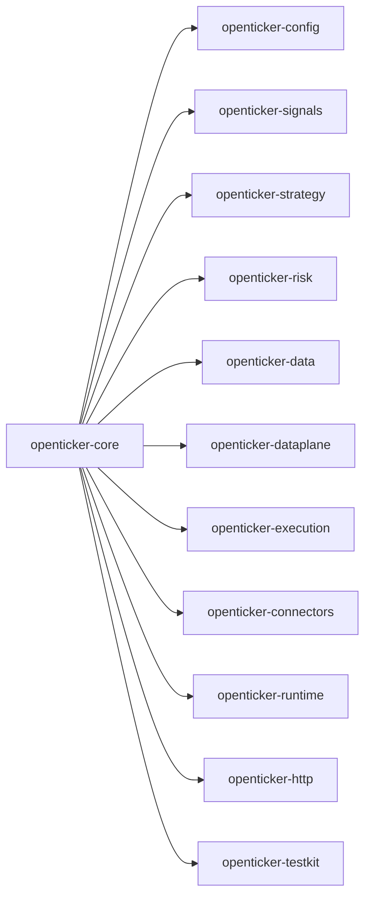

# ARCHITECTURE

Last reviewed: 2026-04-18

## Role

`openticker-core` is the smallest shared domain-contract crate in the workspace.

It exists to hold connector-agnostic types that multiple other crates need to agree on:

- market and execution enums
- timeframe parsing and serialization
- typed identifiers
- the normalized OHLCV bar shape
- signal, intent, and indicator-role enums

This crate is intentionally narrow. It is not yet the full shared trading model described in some higher-level architecture docs.

## Entry Surface

Public API is re-exported from `src/lib.rs`.

Important public types:

- `MarketType`
- `ExecutionMode`
- `Timeframe`
- `InstanceId`
- `AccountId`
- `BotLaneKey`
- `OhlcvBar`
- `SignalPhase`
- `CrossType`
- `IndicatorSignal`
- `TradeIntent`
- `IndicatorRole`
- `IndicatorStabilityClass`
- `IndicatorSignalPolicy`
- `CoreError`

Important implementation detail:

- `Timeframe` has handwritten `Display`, `FromStr`, and serde behavior. Its serialized labels are part of the workspace contract.

## Internal Layout

Current file layout is intentionally small but contextual.

| Path | Responsibility |
| --- | --- |
| `src/lib.rs` | Module declarations and public re-exports |
| `src/error.rs` | Shared core error enum |
| `src/identifiers.rs` | Typed identifiers and parse validation (`InstanceId`, `AccountId`, `BotLaneKey`) |
| `src/market.rs` | Market-mode enums and normalized OHLCV bar model |
| `src/signals.rs` | Signal enums and indicator metadata contracts |
| `src/timeframe.rs` | Timeframe model, `Display`/`FromStr`, and custom serde behavior |
| `src/trade.rs` | Trade intent enum |

Test placement:

- `src/timeframe.rs` contains timeframe parse behavior tests.
- `src/identifiers.rs` contains identifier parse validation tests.

## Direct Dependency Wiring

This crate has no workspace-crate dependencies.

It only depends on small external crates for timestamps, serialization, and error derivation.

## Inbound Wiring

`openticker-core` is depended on by most other implementation crates, including:

- `openticker-config`
- `openticker-signals`
- `openticker-strategy`
- `openticker-risk`
- `openticker-data`
- `openticker-dataplane`
- `openticker-execution`
- `openticker-connectors`
- `openticker-runtime`
- `openticker-http`
- `openticker-testkit`

In practice, this makes `openticker-core` the narrowest stable center of the workspace.

## Outbound Wiring

There is no outbound workspace wiring from this crate.

It defines types. It does not call into other workspace crates.

## Current Implementation Realities

- The crate is smaller than the broader workspace architecture suggests.
- Only a small wrapper set exists today: `InstanceId`, `AccountId`, and `BotLaneKey`.
- Full shared order, fill, position, and portfolio models do not live here yet.
- `TradeIntent` already includes `ReduceLong`, but current strategy implementations mostly emit `OpenLong`, `AddLong`, `CloseLong`, or `NoOp`.
- Because this crate sits at the center of serialization, even small enum or label changes ripple through config parsing, runtime journaling, and HTTP output.

## Practical Wiring Notes

- `openticker-config` relies on `Timeframe`, `ExecutionMode`, `MarketType`, and indicator-role enums for schema validation.
- `openticker-signals` relies on `OhlcvBar`, `SignalPhase`, and `IndicatorSignal` for pure indicator evaluation.
- `openticker-strategy` and `openticker-risk` rely on `TradeIntent` as the shared decision boundary.
- `openticker-data` and `openticker-dataplane` rely on `OhlcvBar` and `Timeframe` as their normalized market-data contract.

## Diagram

