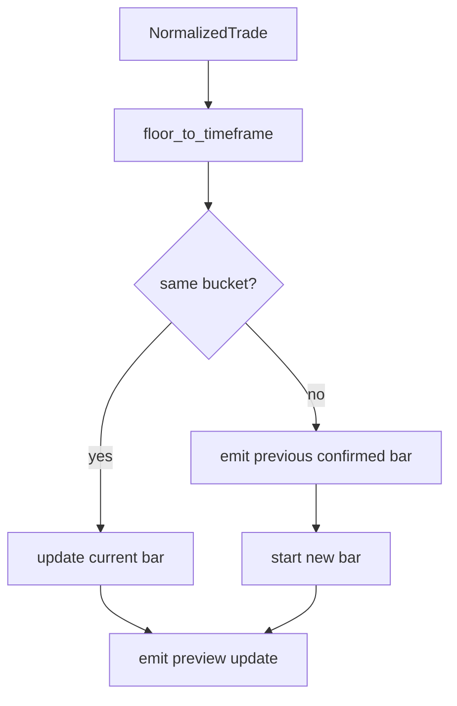

# ARCHITECTURE

Last reviewed: 2026-04-18

## Role

`openticker-data` owns the normalized market-data transformation layer.

Its current center of gravity is:

- venue-neutral trade representation
- quote and order-event normalization types
- trade-to-bar aggregation through `BarBuilder`
- preview versus confirmed bar-update semantics
- simple market-session classification

This crate does not parse venue payloads directly. That boundary stays in `openticker-connectors`.

## Entry Surface

Important public types:

- `NormalizedTrade`
- `NormalizedQuote`
- `NormalizedOrderEvent`
- `NormalizedBarUpdate`
- `MarketSession`
- `BarBuilder`
- `DataError`

Important public functions and methods:

- `BarBuilder::new(...)`
- `BarBuilder::push_trade(...)`
- `BarBuilder::flush_confirmed()`
- `market_session_for(...)`

## Internal Layout

The crate is now split into contextual modules with `src/lib.rs` as a re-export surface.

| Path | Responsibility |
| --- | --- |
| `src/lib.rs` | Public API re-exports |
| `src/normalized.rs` | Normalized trade, quote, order-event, and bar-update shapes |
| `src/bar_builder.rs` | `BarBuilder`, bucket flooring, and bar mutation helpers |
| `src/market_session.rs` | `MarketSession` and `market_session_for` |
| `src/error.rs` | `DataError` |

Tests are colocated with behavior modules:

1. `src/bar_builder.rs` for preview/confirmed transition behavior
2. `src/market_session.rs` for session classification behavior

## Direct Dependency Wiring

Workspace dependencies:

| Crate | Used For |
| --- | --- |
| `openticker-core` | `MarketType`, `OhlcvBar`, `SignalPhase`, `Timeframe` |

## Inbound Wiring

Primary consumers:

- `openticker-runtime` owns one `BarBuilder` per instance and converts trades into bar updates before indicator evaluation
- `openticker-http` accepts `NormalizedTrade` on the simulate-trade endpoint
- `openticker-connectors` uses the normalized types as the output boundary for stream and order-event normalization

## Outbound Wiring

This crate does not orchestrate other workspace crates.

Its outputs are consumed elsewhere:

- `NormalizedBarUpdate` feeds runtime processing
- `OhlcvBar` is the shared downstream shape used by signals, runtime, and dataplane

## Aggregation Flow

Current `BarBuilder` behavior is:

1. receive a `NormalizedTrade`
2. floor its timestamp into the configured timeframe bucket
3. if the bucket matches the current bar, update that bar and emit a preview update
4. if the bucket rolls over, emit the old bar as confirmed
5. create a new current bar from the incoming trade
6. emit the new current bar as preview
7. `flush_confirmed()` can force the current bar into a confirmed state when needed

## Current Implementation Realities

- `BarBuilder` stores the symbol it is responsible for, but symbol validation is performed by runtime before calling into it.
- `push_trade(...)` rejects negative quantity but currently allows zero quantity.
- Equity market-session classification uses fixed UTC windows rather than an exchange calendar abstraction.
- This crate already contains more than just trade aggregation; it also defines quote and order-event normalized shapes.
- Recent refactoring changed file layout only; public behavior and exports are unchanged.

## Practical Wiring Notes

- Changes to bucket flooring or rollover behavior directly affect signal replay and runtime processing semantics.
- Preview versus confirmed semantics start here, so downstream crates inherit this timing model.
- Connector payload parsing should stay outside this crate, with only normalized shapes crossing the boundary.

## Diagram

