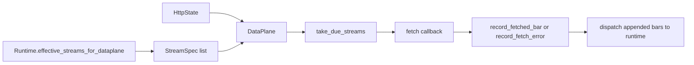

# ARCHITECTURE

Last reviewed: 2026-04-18

## Role

`openticker-dataplane` owns always-on stream scheduling and in-memory bar retention.

It is the workspace layer responsible for:

- deduplicating logical streams by `(account, symbol, timeframe)`
- tracking stream polling cadence and health
- retaining recent bars in memory for operator visibility
- exposing stream and metrics snapshots
- providing the async `run_forever(...)` polling loop abstraction

This crate is venue-neutral and does not evaluate signals or persist data.

## Entry Surface

Important public types:

- `StreamKey`
- `StreamSource`
- `StreamSpec`
- `StreamStatus`
- `StreamRegistry`
- `StreamBuffer`
- `DataPlane`
- `DataPlaneMetricsSnapshot`
- `LatencyMetricSnapshot`
- `DataPlaneError`

Important public methods:

- `StreamRegistry::from_specs(...)`
- `StreamRegistry::insert(...)`
- `DataPlane::new(...)`
- `DataPlane::replace_streams(...)`
- `DataPlane::registered_streams()`
- `DataPlane::take_due_streams(...)`
- `DataPlane::record_fetched_bar(...)`
- `DataPlane::record_fetch_error(...)`
- `DataPlane::record_manual_poll_attempt(...)`
- `DataPlane::snapshot_bars(...)`
- `DataPlane::snapshot_streams()`
- `DataPlane::metrics_snapshot()`
- `DataPlane::run_forever(...)`

## Internal Layout

The crate is split by concern with a thin facade in `src/lib.rs`.

| Path | Responsibility |
| --- | --- |
| `src/lib.rs` | Module wiring and public re-exports |
| `src/stream.rs` | Stream identity/spec/status models and stream key ordering |
| `src/registry.rs` | Stream spec merge and deduplication logic |
| `src/buffer.rs` | Bounded in-memory bar retention and sparkline projection |
| `src/metrics.rs` | Dataplane counters and latency metrics snapshots |
| `src/dataplane.rs` | DataPlane state, lifecycle methods, and async polling loop |
| `src/tests.rs` | Crate-level tests |

## Direct Dependency Wiring

Workspace dependencies:

| Crate | Used For |
| --- | --- |
| `openticker-core` | `OhlcvBar` and `Timeframe` |

## Inbound Wiring

Primary consumers:

- `openticker-runtime` computes desired stream specs through `effective_streams_for_dataplane()`
- `openticker-http` owns the actual `Arc<DataPlane>` inside `HttpState`

## Outbound Wiring

This crate does not talk to connectors or runtime directly.

Instead, `openticker-http` wires its async loop by passing callbacks into `run_forever(...)`:

- fetch callback: use connector registry to fetch bars
- success callback: dispatch appended bars back into runtime

That makes the crate runtime-neutral while still hosting the generic scheduler.

## Scheduling Flow

Current flow is:

1. runtime computes a `StreamRegistry`
2. HTTP installs it into `DataPlane` with `replace_streams(...)`
3. `run_forever(...)` repeatedly asks `take_due_streams(...)` for work
4. the injected fetch callback retrieves the latest bar for each due stream
5. `record_fetched_bar(...)` updates retention, status, and metrics
6. appended bars are handed back to runtime for signal processing
7. HTTP and dashboard consumers read stream snapshots and sparkline data from `DataPlane`

## Current Implementation Realities

- The crate is now module-split by concern; `src/dataplane.rs` still centralizes orchestration methods.
- It depends on Tokio because `run_forever(...)` lives here, even though most core state transitions are synchronous.
- The background loop is not owned by runtime. It is started by `openticker-http`.
- `fetch_count` increments when a stream becomes due, not only on successful remote fetch.
- `record_fetched_bar(...)` updates success timing even if the bar is not newer than retained history.

## Practical Wiring Notes

- The public surface is intentionally serialization-friendly because both HTTP and dashboard surfaces consume its snapshots.
- Bars remain in memory only. Persistence belongs elsewhere.
- Connector fetch logic should stay outside this crate.

## Diagram

