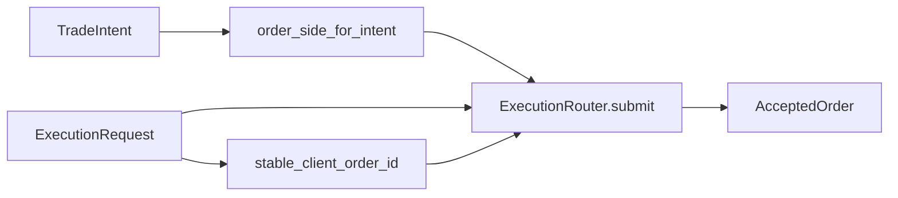

# ARCHITECTURE

Last reviewed: 2026-04-18

## Role

`openticker-execution` defines the venue-neutral execution contract for the workspace.

Its current responsibilities are:

- modeling a normalized execution request
- modeling the accepted-order response shape
- modeling quantity-resolution outcomes for executable intents
- mapping `TradeIntent` into `OrderSide`
- generating deterministic client order IDs
- resolving order quantities against market policy and execution constraints
- providing a paper router implementation

This crate is intentionally small and does not contain venue adapters.

## Entry Surface

Important public types:

- `OrderSide`
- `OrderType`
- `ExecutionRequest`
- `AcceptedOrder`
- `OrderLedgerOutcome`
- `OrderQuantityResolution`
- `ExecutionRouter`
- `PaperExecutionRouter`
- `ExecutionError`

Important public helpers:

- `stable_client_order_id(...)`
- `order_side_for_intent(...)`
- `resolve_order_quantity_with_constraints(...)`

## Internal Layout

The crate uses a thin public surface in `src/lib.rs` and module-focused implementation files.

| Path | Responsibility |
| --- | --- |
| `src/lib.rs` | Module wiring and public re-exports |
| `src/types.rs` | Execution enums and request/response models |
| `src/error.rs` | `ExecutionError` variants |
| `src/helpers.rs` | Intent-to-side mapping, stable client-order ID helper, helper tests |
| `src/sizing.rs` | Order-quantity resolution, market rounding policy, and constraint handling |
| `src/router.rs` | `ExecutionRouter` trait, `PaperExecutionRouter`, router tests |

Logical sections:

1. public re-export surface
2. order-side and order-type enums
3. `ExecutionRequest`
4. `AcceptedOrder`
5. `ExecutionError`
6. helper functions
7. quantity-resolution contracts and helpers
8. `ExecutionRouter` trait
9. `PaperExecutionRouter`
10. module-local tests

## Direct Dependency Wiring

Workspace dependencies:

| Crate | Used For |
| --- | --- |
| `openticker-core` | `TradeIntent` |

## Inbound Wiring

Primary consumers:

- `openticker-runtime` builds `ExecutionRequest` values after strategy, budgeting, and risk evaluation
- `openticker-connectors` consumes `ExecutionRequest` and returns `AcceptedOrder`, while reusing `PaperExecutionRouter` in some paths

## Outbound Wiring

This crate does not call into connectors or runtime itself.

It defines the contract both layers meet at.

## Request-To-Accepted Flow

Current execution contract flow is:

1. runtime produces an `ExecutionRequest`
2. order side is derived from `TradeIntent` through `order_side_for_intent(...)`
3. runtime resolves an executable quantity through `resolve_order_quantity_with_constraints(...)`
4. client order ID is generated through `stable_client_order_id(...)`
5. a router or connector validates quantity and price semantics
6. an `AcceptedOrder` is returned to runtime

## Current Implementation Realities

- Only market-order semantics are modeled today.
- `OrderType` exists, but `ExecutionRequest` does not yet carry an order-type field.
- `PaperExecutionRouter` is the only concrete router in this crate.
- `NoOp` remains non-executable by design.
- The stable client-order ID is built from instance ID, timestamp, and intent; it does not currently include account or symbol information.

## Practical Wiring Notes

- This crate is the normalized seam between runtime decision-making and connector-specific order submission.
- If `ExecutionRequest` or `AcceptedOrder` changes, both runtime and connectors usually need coordinated updates.
- Deterministic client-order ID behavior is part of downstream reconciliation and duplicate-submission protection.

## Diagram

