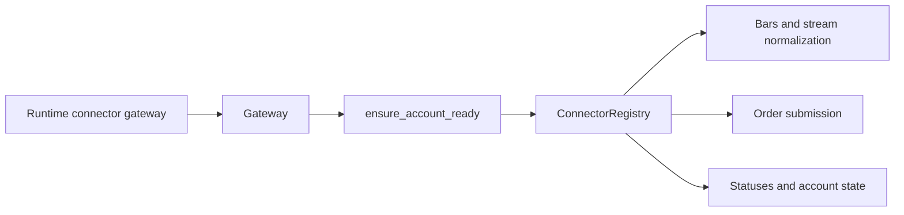

# ARCHITECTURE

Last reviewed: 2026-04-18

## Role

`openticker-gateway` is a thin facade around `ConnectorRegistry` that provides a
stable, runtime-agnostic connector access boundary.

Its responsibilities are:

- building `ConnectorRegistry` from validated account config
- exposing connector account statuses and readiness
- checking account readiness before market-data and execution operations
- forwarding market-data normalization and bar fetch calls
- forwarding symbol-constraints and order-submission calls
- normalizing connector symbol constraints into shared execution constraints
- merging configured and connector-provided execution constraints
- normalizing registry and connector failures into `GatewayError`

## Entry Surface

Important public types:

- `Gateway`
- `GatewayError`
- `NormalizedSymbolConstraints`

Important public methods:

- `statuses(...)`
- `is_ready(...)`
- `account_kind(...)`
- `ensure_account_ready(...)`
- `fetch_account_snapshot_unchecked(...)`
- `normalize_market_stream_payload(...)`
- `fetch_latest_bar(...)`
- `fetch_recent_bars(...)`
- `fetch_symbol_constraints_unchecked(...)`
- `fetch_normalized_symbol_constraints_unchecked(...)`
- `submit_order(...)`

Important public helpers:

- `build_connector_registry(...)`
- `normalize_symbol_constraints(...)`
- `execution_constraints_are_complete(...)`
- `resolve_effective_execution_constraints(...)`

## Internal Layout

| Path | Responsibility |
| --- | --- |
| `src/lib.rs` | module index and public root re-exports |
| `src/error.rs` | `GatewayError` and connector-error conversion |
| `src/gateway.rs` | `Gateway` facade: lock and readiness helpers, rate-limit tracking, status/market-data/execution operations |
| `src/registry.rs` | connector-registry construction helper |
| `src/constraints.rs` | symbol-constraint normalization and resolution helpers |
| `src/tests.rs` | unit tests |

## Direct Dependency Wiring

Workspace dependencies:

| Crate | Used For |
| --- | --- |
| `openticker-connectors` | connector registry and account/market/execution connector contracts |
| `openticker-core` | `OhlcvBar` and `Timeframe` |
| `openticker-data` | `NormalizedBarUpdate` |
| `openticker-execution` | `ExecutionRequest` and `AcceptedOrder` |

External dependencies:

| Crate | Used For |
| --- | --- |
| `thiserror` | `GatewayError` derive |

## Inbound Wiring

Primary consumer:

- `openticker-runtime` (`src/connector_gateway.rs`, `src/accounting.rs`,
  reconciliation and execution paths)

## Outbound Wiring

Gateway calls into `ConnectorRegistry` methods and does not call storage, HTTP,
or CLI layers.

## Request Flow

Readiness-gated flow is:

1. runtime calls gateway operation
2. gateway checks account readiness via `ensure_account_ready(...)`
3. gateway forwards to connector registry
4. gateway returns normalized error or connector output

Unchecked flow is:

1. runtime calls `fetch_account_snapshot_unchecked(...)` or
   `fetch_symbol_constraints_unchecked(...)`
2. gateway forwards directly to registry without readiness pre-check

## Current Implementation Realities

- Registry access is protected by `Arc<Mutex<ConnectorRegistry>>`.
- Connector-facing calls are made while holding the registry lock.
- Readiness reasons are assembled as a concatenated string that includes
  resilience metadata.
- This crate has module-local tests for constraint normalization and registry construction.

## Practical Wiring Notes

- Runtime maps `GatewayError` into runtime-specific service errors and provider
  events; changes to error semantics are cross-crate changes.
- Readiness-gating policy here directly affects execution, polling, and
  reconciliation behavior in runtime.
- Runtime still owns provider-event journaling around gateway calls even though
  registry construction now lives here.

## Diagram

