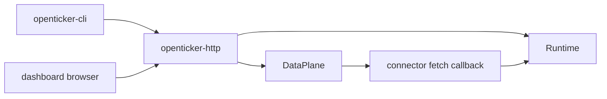

# ARCHITECTURE

Last reviewed: 2026-04-19

## Role

`openticker-http` is the Axum control plane over `openticker-runtime`.

It owns:

- router construction and middleware wiring
- route constants and generated OpenAPI route list
- health and readiness endpoints
- metrics output
- config reload and effective-config endpoints
- connector and data-stream inspection endpoints
- instance lifecycle and operator action endpoints
- journal-backed inspection endpoints through runtime
- embedded dashboard HTML serving
- startup and shutdown wiring for the runtime-owned polling supervisor

This crate is the control-plane contract consumed by the CLI and dashboard.

## Entry Surface

Important public items:

- route constants such as:
  - `HEALTH_PATH`
  - `READY_PATH`
  - `METRICS_PATH`
  - `SERVICE_STATUS_PATH`
  - `DATA_STREAMS_PATH`
  - `BOTS_PATH`
- `HttpState`
- `HealthResponse`
- `ReadyResponse`
- `build_router(...)`
- `load_http_state(...)`
- `serve(...)`

Important internal entrypoints:

- `config_reload_handler(...)` in `src/handlers.rs`
- instance lifecycle handlers in `src/handlers.rs`
- metrics and status handlers in `src/handlers.rs`

## Internal Layout

The crate is now split into focused modules.

| Path | Responsibility |
| --- | --- |
| `src/lib.rs` | crate root re-exports and HTTP tests |
| `src/constants.rs` | route constants, OpenAPI route descriptors, OpenAPI generation, shared constants |
| `src/state.rs` | `HttpState` and HTTP-facing response/projection structs |
| `src/router.rs` | `build_router(...)` and route registration |
| `src/runtime.rs` | `load_http_state(...)`, `serve(...)`, and runtime-owned polling supervisor wiring |
| `src/handlers.rs` | endpoint handlers plus handler-level helper logic |
| `static/dist/index.html` | embedded dashboard frontend served at `/` and `/dashboard` |

## Direct Dependency Wiring

Workspace dependencies:

| Crate | Used For |
| --- | --- |
| `openticker-config` | config loading and reload |
| `openticker-connectors` | connector capability matrix endpoint |
| `openticker-core` | shared request and response domain types |
| `openticker-dataplane` | dataplane snapshots, metrics, retention, and scheduler substrate |
| `openticker-data` | `NormalizedTrade` for simulated trade injection |
| `openticker-runtime` | backend service state, lifecycle, reconciliation, and journal APIs |

## Inbound Wiring

Primary consumers:

- `openticker-cli`, both for in-process service startup and API contract usage
- browser-driven dashboard traffic hitting the embedded routes
- local operator tooling that calls HTTP endpoints directly

## Outbound Wiring

This crate orchestrates outward to:

- `openticker-runtime` for service state, lifecycle control, journal reads, and signal/execution processing
- `openticker-dataplane` for stream replacement, polling, retention snapshots, and metrics
- `openticker-config` for reload and effective-config derivation
- `openticker-connectors` for connector capability metadata only

## Control-Plane Flow

Current `serve(...)` flow is:

1. build `HttpState`
2. bind the server socket
3. start `RuntimePollingSupervisor`
4. construct Axum router
5. serve HTTP requests

Current runtime-owned polling flow is:

1. `serve(...)` starts `RuntimePollingSupervisor`
2. the supervisor runs `DataPlane::run_forever(...)`
3. the runtime-owned callbacks fetch latest bars through connector callbacks
4. dataplane metrics and retention are updated
5. appended bars are dispatched back into runtime

## Current Implementation Realities

- The crate is modularized, but `src/handlers.rs` is still large and spans multiple endpoint domains.
- Polling ownership now lives in `openticker-runtime`; this crate only starts
  and stops the runtime-owned supervisor.
- OpenAPI is generated from a handwritten route table rather than typed schema derivation.
- `HttpState` owns both the runtime lock and the dataplane object.
- Some HTTP response shapes are thin wrappers over runtime DTOs, while others are HTTP-specific projections.

## Practical Wiring Notes

- Changes in route shape or response shape usually break `openticker-cli` quickly.
- New operator behavior should prefer new runtime methods instead of embedding business logic in handlers.
- This crate is the composition boundary where runtime and dataplane are joined into one service process.

## Diagram

