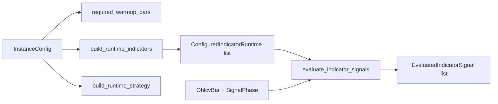

# ARCHITECTURE

Last reviewed: 2026-04-18

## Role

`openticker-instance` turns validated instance config into executable indicator
and strategy runtime state.

Its responsibilities are:

- deriving warmup targets from indicator manifest metadata
- building runtime indicator engines from instance config
- building runtime strategy engines from instance config
- evaluating indicator signals for preview and confirmed phases
- selecting representative indicator output and default signal policy

## Entry Surface

Important public types:

- `InstanceError`
- `ConfiguredIndicatorRuntime`
- `EvaluatedIndicatorSignal`
- `RuntimeIndicatorEngine`
- `RuntimeStrategyEngine`
- `IndicatorEvaluationEnvelope`

Important public functions:

- `required_warmup_bars(...)`
- `build_runtime_indicators(...)`
- `build_runtime_strategy(...)`
- `evaluate_indicator_signals(...)`
- `representative_indicator(...)`
- `default_signal_policy(...)`

## Internal Layout

| Path | Responsibility |
| --- | --- |
| `src/lib.rs` | Indicator/strategy builders, evaluation logic, and tests |

Logical sections:

1. runtime engine enums and DTOs
2. warmup and strategy helpers
3. indicator-engine factory and parameter helpers
4. signal-evaluation pipeline
5. module-local tests

## Direct Dependency Wiring

Workspace dependencies:

| Crate | Used For |
| --- | --- |
| `openticker-config` | `InstanceConfig`, indicator config, signal mode |
| `openticker-core` | signal and metadata model types, bar and phase types |
| `openticker-signals` | concrete indicators, manifest metadata, indicator-engine contracts |
| `openticker-strategy` | runtime strategy engine types |

External dependencies:

| Crate | Used For |
| --- | --- |
| `thiserror` | `InstanceError` derive |

## Inbound Wiring

Primary consumer:

- `openticker-runtime` (`src/runtime_wiring.rs` and runtime model wiring)

## Outbound Wiring

This crate has no outbound orchestration.

It consumes config and signal crates to produce pure runtime-wiring values.

## Build And Evaluation Flow

Current setup flow is:

1. runtime passes `InstanceConfig`
2. `required_warmup_bars(...)` derives warmup target
3. `build_runtime_indicators(...)` instantiates enabled indicators
4. `build_runtime_strategy(...)` instantiates the selected strategy

Per-bar evaluation flow is:

1. runtime passes bar and phase to `evaluate_indicator_signals(...)`
2. each indicator evaluates through `RuntimeIndicatorEngine::evaluate(...)`
3. preview phase clones engine state; confirmed phase mutates engine state
4. evaluated signal, metadata, and weighting context are returned

## Current Implementation Realities

- Indicator wiring is still a manual enum + match factory.
- Strategy support is currently limited to `single_indicator_signal` and
  `consensus`.
- Parameter parsing is currently local helper logic (`f64`/`usize`) rather than
  centralized schema-driven parsing.
- Most logic lives in one large file (`src/lib.rs`).

## Practical Wiring Notes

- If indicator identifiers or parameter contracts change, config validation and
  runtime wiring should usually be updated together.
- If preview/confirmed semantics change, runtime signal sequencing behavior and
  tests can drift quickly.

## Diagram

