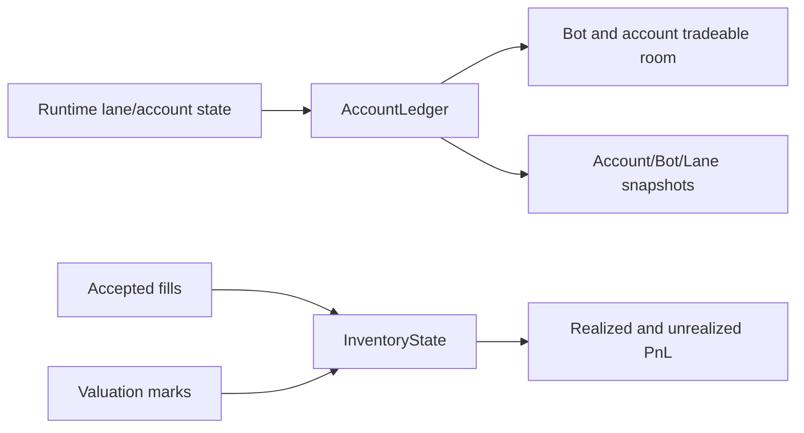

# ARCHITECTURE

Last reviewed: 2026-04-18

## Role

`openticker-ledger` owns deterministic accounting primitives for capital ownership,
reservation tracking, inventory lot math, and portfolio snapshot shapes.

Its core responsibilities are:

- owner-path based open-notional accounting
- reservation and release transitions
- account/bot/lane room calculations
- account-level exception blocking semantics
- lot-based realized and unrealized inventory math
- normalized snapshot DTOs used by runtime-facing read models

This crate is intentionally pure and does not contain connector I/O, runtime
orchestration, or HTTP concerns.

## Entry Surface

Important public state and domain types:

- `AccountLedger`
- `LedgerOwnerPath`
- `LedgerException`, `LedgerExceptionKind`
- `ReservationError`
- `InventoryState`, `InventoryFillSide`, `InventoryError`
- `PositionLot`, `FeeEntry`, `RealizedPnl`, `UnrealizedPnl`, `ValuationMark`
- `LedgerSnapshot`, `AccountPortfolioSnapshot`, `BotPortfolioSnapshot`,
  `LanePortfolioSnapshot`

Important public helpers:

- `sanitize_ledger_value(...)`
- `calculate_position_notional_usd(...)`

## Internal Layout

| Path | Responsibility |
| --- | --- |
| `src/lib.rs` | Module wiring and public re-exports |
| `src/account_ledger.rs` | Ownership and reservation state machine, room calculations, snapshots |
| `src/inventory.rs` | Lot accounting, fill transitions, realized/unrealized PnL |
| `src/portfolio.rs` | Snapshot DTO definitions |
| `src/types.rs` | Owner-path, exception, allocation-policy, and reservation model types |
| `src/util.rs` | Value sanitization and small arithmetic helpers |

Logical sections:

1. owner-path and exception model
2. account-level open/reserved notional state
3. reservation/reconciliation transitions
4. lot-based inventory updates
5. snapshot DTO output

## Direct Dependency Wiring

Workspace dependencies:

- none

External dependencies:

| Crate | Used For |
| --- | --- |
| `serde` | serialization for snapshot and inventory-facing value types |

## Inbound Wiring

Primary consumers:

- `openticker-runtime` (capital-room decisions, inventory sync, API-facing snapshots)
- `openticker-portfolio` (snapshot composition and account-refresh helpers)

## Outbound Wiring

This crate has no outbound orchestration.

It returns pure values and does not call runtime, connectors, storage, or HTTP.

## Accounting Flow

Current owner-path accounting flow is:

1. runtime supplies lane open-notional and exception inputs
2. `AccountLedger` tracks attributed open, reserved open, and unattributed open notional
3. reservation transitions run through `try_reserve_open(...)` and
   `reconcile_open_fill(...)`
4. account and bot room calculations are derived from effective cap and
   committed notional
5. sorted snapshots are emitted for account/bot/lane views

Inventory flow is:

1. runtime reconstructs or updates `InventoryState`
2. fills apply through `apply_fill(...)`
3. realized PnL accumulates on sells, unrealized PnL derives from marks

## Current Implementation Realities

- Owner policy and ownership resolution types exist, but most live ownership
  resolution is currently performed in `openticker-portfolio` helpers.
- `sanitize_value` clamps non-finite and non-positive values to zero, aligning
  with long-only spot assumptions.
- Exception kinds include `UnpricedInventory` and `FeeNormalizationMissing`, but
  current callers mostly emit ownership-related exceptions.

## Practical Wiring Notes

- If snapshot or ledger-room semantics change, runtime and API read-model users
  usually need coordinated updates.
- If inventory semantics change, runtime inventory sync paths in
  `crates/openticker-runtime/src/shared/inventory.rs` should be reviewed.

## Diagram

