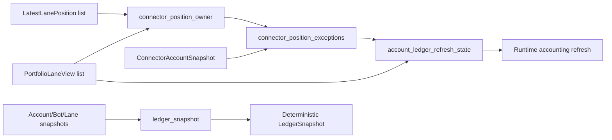

# ARCHITECTURE

Last reviewed: 2026-04-18

## Role

`openticker-portfolio` provides pure accounting and ownership-resolution helpers
for runtime-driven lane and account views.

Its responsibilities are:

- composing deterministic `LedgerSnapshot` output ordering
- mapping lane views into owner-path open-notional entries
- resolving connector-position ownership against runtime lanes and latest
  positions
- classifying remote open orders against journal-derived managed identities
- filtering connector and journal open-order state for reconciliation
- projecting pure reconciliation summary state from journal and connector views
- assembling final reconciliation assessment DTOs from pure inputs
- owning pure reconciliation DTOs consumed by runtime orchestration
- producing ledger exceptions for unmatched or ambiguous ownership
- deriving account risk, account refresh helper outputs, and pure
  ledger-rejection payload wrappers

## Entry Surface

Important public types:

- `PortfolioLaneView`
- `AccountRiskSnapshot`
- `ConnectorPositionOwner`
- `LatestLanePosition`
- `AccountLedgerRefreshState`
- `ClassifiedRemoteOpenOrders`
- `ReconciliationAssessmentSummary`
- `ReconciliationAssessment`

Important public helpers:

- `ledger_snapshot(...)`
- `lane_open_notionals(...)`
- `latest_authoritative_position(...)`
- `classify_remote_open_orders(...)`
- `open_orders_for_symbol(...)`
- `position_quantity_for_symbol(...)`
- `local_open_order_ids(...)`
- `reconciliation_differences(...)`
- `reconciliation_assessment_summary(...)`
- `build_reconciliation_assessment(...)`
- `ledger_rejection_event_payload(...)`
- `unmapped_managed_open_order_exceptions(...)`
- `apply_account_ledger_refresh_state(...)`
- `sync_account_ledger_from_lanes(...)`
- `connector_position_owner(...)`
- `connector_position_exceptions(...)`
- `account_ledger_refresh_state(...)`
- `account_risk_snapshot(...)`
- `live_balance_from_snapshot(...)`

## Internal Layout

| Path | Responsibility |
| --- | --- |
| `src/lib.rs` | Module declarations, shared tolerance constant, and public re-exports |
| `src/balances.rs` | Live-balance derivation from connector snapshots |
| `src/exceptions.rs` | Ledger exception derivation (deficits, unmapped managed orders) |
| `src/exposure.rs` | Account symbol exposure and connector-position ownership resolution |
| `src/lanes.rs` | Lane/account view DTOs and account-risk rollup |
| `src/ledger_sync.rs` | Ledger snapshot composition, room queries, and refresh/sync application |
| `src/orders.rs` | Open-order identity, filtering, and managed/external classification |
| `src/positions.rs` | Position-record authority rules and latest-position lookups |
| `src/reconciliation.rs` | Reconciliation assessment assembly and reason parsing |
| `src/rejections.rs` | Ledger rejection payload DTOs and builders |
| `src/symbols.rs` | Connector-symbol vs lane-symbol matching helpers |
| `src/tests.rs` | Module-local tests |

## Direct Dependency Wiring

Workspace dependencies:

| Crate | Used For |
| --- | --- |
| `openticker-connectors` | `ConnectorAccountSnapshot` input |
| `openticker-ledger` | owner-path and exception types, snapshot output types, value sanitization |
| `openticker-storage` | `PositionRecord` input for ownership heuristics |

## Inbound Wiring

Primary consumer:

- `openticker-runtime` (`src/accounting.rs` and repo/accounting helpers)

Runtime uses this crate to refresh account ledgers from connector snapshots,
derive account risk rollups, and build final `LedgerSnapshot` output.

## Outbound Wiring

This crate has no outbound orchestration.

It consumes connector/journal-derived values and returns transformed pure values.

## Ownership And Refresh Flow

Current refresh helper flow is:

1. runtime provides lanes, latest positions, and connector snapshot
2. `connector_position_owner(...)` resolves symbol ownership across lanes
3. `connector_position_exceptions(...)` builds blocking exceptions
4. `account_ledger_refresh_state(...)` returns lane open notionals,
   live balance, and exceptions

Snapshot composition flow is:

1. runtime supplies account/bot/lane snapshot vectors
2. `ledger_snapshot(...)` sorts all vectors deterministically
3. sorted `LedgerSnapshot` is returned

## Current Implementation Realities

- `live_balance_from_snapshot(...)` currently supports account-kind specific
  logic for `alpaca` and `binance` only.
- Symbol matching supports exact match and a small base-asset suffix heuristic.
- Position-state heuristics depend on free-form reason strings such as
  `close_requested` and `_reconciliation_sync`.

## Practical Wiring Notes

- If exception kinds or ownership heuristics change, runtime accounting,
  reconciliation behavior, and operator-visible ledger snapshots may change.
- If ledger snapshot ordering changes, API and CLI diffability may change.

## Diagram

