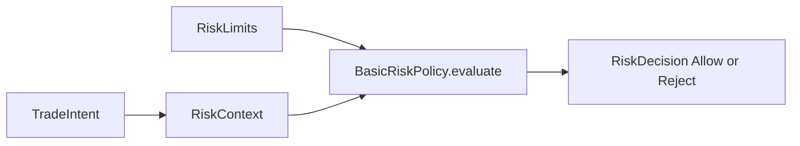

# ARCHITECTURE

Last reviewed: 2026-04-18

## Role

`openticker-risk` is the pure risk-evaluation layer.

It evaluates a proposed `TradeIntent` against configured limits and runtime-supplied context, then returns either:

- `RiskDecision::Allow(...)`
- `RiskDecision::Reject { reason }`

This crate is deliberately side-effect free.

## Entry Surface

Important public types:

- `RiskLimits`
- `RiskContext`
- `RiskDecision`
- `RiskPolicy`
- `BasicRiskPolicy`

Important behavior:

- `RiskPolicy::evaluate(...)`
- `BasicRiskPolicy::evaluate(...)`

## Internal Layout

The crate is implemented as a small module set.

| Path | Responsibility |
| --- | --- |
| `src/lib.rs` | Module wiring and public re-exports |
| `src/types.rs` | Risk model types (`RiskLimits`, `RiskContext`, `RiskDecision`) |
| `src/policy.rs` | Risk policy trait and `BasicRiskPolicy` implementation |
| `src/tests.rs` | Unit tests for policy behavior (`#[cfg(test)]`) |

Logical sections remain the same:

1. limit and context structs
2. decision enum
3. risk-policy trait
4. basic policy implementation
5. unit tests

## Direct Dependency Wiring

Workspace dependencies:

| Crate | Used For |
| --- | --- |
| `openticker-core` | `TradeIntent` as the shared decision boundary |

No other workspace dependencies are present.

## Inbound Wiring

Primary consumer:

- `openticker-runtime`

Runtime constructs `RiskLimits`, fills `RiskContext`, calls `BasicRiskPolicy::evaluate(...)`, and persists the resulting decision in `openticker-storage`.

## Outbound Wiring

This crate has no outbound orchestration.

It returns a `RiskDecision` to runtime and does not call into storage, connectors, HTTP, or config.

## Evaluation Order

Current `BasicRiskPolicy` evaluation order matters because reject reasons are operator-visible:

1. kill switch
2. price and quantity validation
3. pass-through for non-open/add intents
4. cooldown window
5. stale-data block
6. spread threshold
7. slippage threshold
8. daily-loss threshold
9. order-notional limit
10. max-open-positions limit

## Current Implementation Realities

- Decisions are binary today. There is no modify-or-clamp behavior.
- Opening and adding long positions receive the full check chain.
- Reducing and closing positions are effectively pass-through after basic validation.
- Runtime currently supplies placeholder market-quality inputs in some paths, so not all risk fields are fully live-sourced yet.
- Some checks described in broader architecture docs, such as gross exposure or per-position notional, are not modeled here yet.

## Practical Wiring Notes

- If `RiskContext` or `RiskLimits` changes, `openticker-runtime` must change with it.
- This crate should stay the final pure gate before execution submission.
- Reject reasons are part of the operator experience and persisted audit trail, so ordering and wording both matter.

## Diagram

