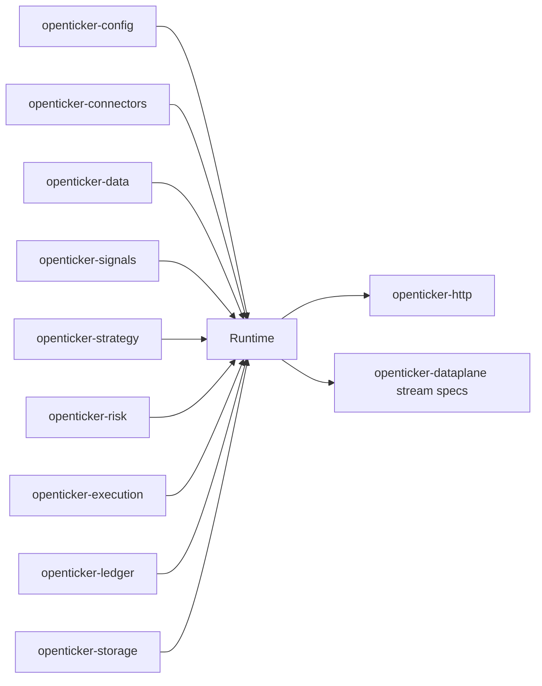

# ARCHITECTURE

Last reviewed: 2026-07-14

## Role

`openticker-runtime` is the composition root of the workspace.

It is responsible for:

- bootstrapping runtime state from validated config
- constructing connectors, indicators, strategies, risk policies, ledger state,
  and storage
- owning service-wide and per-lane state
- enforcing startup reconciliation before trading resumes
- running the staged processing pipeline from bars to persisted decisions
- exposing normalized status and journal-backed read models to control-plane
  consumers

This remains the heaviest orchestration crate in the repository.

## Entry Surface

Important public types:

- `Runtime`
- `ServiceStatus`
- `InstanceSummary`
- `LedgerSnapshot`
- `ProcessBarOutcome`
- `ReconciliationCheck`
- `ReconciliationReport`
- `ServiceError`

Important public construction methods:

- `Runtime::from_config(...)`
- `Runtime::from_config_with_storage(...)`

Important public lifecycle and processing methods:

- `start_instance(...)`
- `stop_instance(...)`
- `pause_instance(...)`
- `resume_instance(...)`
- `reconcile_instance(...)`
- `process_trade(...)`
- `process_market_stream_payload(...)`
- `poll_instance_once(...)`
- `fetch_latest_bar_for_instance(...)`
- `dispatch_bar(...)`
- `process_bar(...)`
- `process_manual_signal(...)`
- `cancel_open_orders(...)`
- `close_positions(...)`
- `set_kill_switch(...)`
- `list_instances()`
- `get_instance(...)`
- `status()`
- `connector_statuses()`
- journal-backed inspection methods

Important internal wiring and pipeline functions:

- `build_runtime_strategy(...)`
- `build_runtime_indicator_engine(...)`
- `evaluate_process_bar(...)`
- `apply_risk_decision_effects(...)`
- `apply_process_bar_state(...)`
- `run_startup_reconciliation(...)`

## Internal Layout

The crate uses a behavior-grouped module layout.

| Path | Responsibility |
| --- | --- |
| `src/lib.rs` | Crate-level imports, module declarations, and public re-exports |
| `src/construction.rs` | Boot and runtime-construction paths |
| `src/lifecycle.rs` | Instance lifecycle transitions |
| `src/manual_ops.rs` | Manual operator actions (cancel/close/kill-switch) |
| `src/portfolio_adapter.rs` | Runtime adapter over ledger snapshots and account-budget synchronization |
| `src/connector_gateway.rs` | Connector readiness and symbol-constraint orchestration |
| `src/polling_supervisor/` | Supervisor lifecycle, due-stream polling, and preview-stream workers |
| `src/queries/` | Runtime summary and journal-backed read APIs |
| `src/processing/` | Bar and manual-signal planning/execution/journaling pipeline |
| `src/market_data/` | Ingestion, polling, pending provider events, stream dispatch, recovery, and warmup orchestration |
| `src/reconciliation/` | Startup and manual reconciliation orchestration |
| `src/model/` | Public API DTOs and internal runtime state structs |
| `src/runtime_wiring.rs` | Runtime indicator/strategy builders and engine helpers |
| `src/shared/` | Shared helper functions (labels, budgets, inventory, symbols, event logging) |
| `src/repo/` | Runtime repositories, journal writes/read queries, bootstrap, accounting, and provider events |
| `src/errors.rs` | `ServiceError` |
| `tests/common/mod.rs` | Shared integration-test mock HTTP and temporary database helpers |
| `tests/stock_paper_end_to_end.rs` | Stock paper integration test |
| `tests/stock_reconciliation_restart.rs` | Restart and reconciliation integration test |
| `tests/crypto_kline_ingestion.rs` | Crypto ingestion integration test |

## Direct Dependency Wiring

Workspace dependencies:

| Crate | Used For |
| --- | --- |
| `openticker-config` | validated config bundle, risk profiles, execution constraints |
| `openticker-connectors` | connector registry, snapshots, bars, streams, submission, symbol constraints |
| `openticker-core` | shared domain enums and bar/signal/intent types |
| `openticker-dataplane` | stream-key and stream-spec contracts |
| `openticker-data` | `BarBuilder`, normalized trades, normalized bar updates |
| `openticker-execution` | execution request and accepted-order contract |
| `openticker-ledger` | owner-path accounting, reservations, and portfolio snapshots |
| `openticker-risk` | pure risk evaluation |
| `openticker-signals` | concrete indicator engines and manifest metadata |
| `openticker-storage` | runtime journal backends and record contracts |
| `openticker-strategy` | strategy engines and strategy context types |

Dev dependency:

- `openticker-testkit` for integration-test helpers

## Inbound Wiring

Primary consumers:

- `openticker-http` wraps `Runtime` as control-plane backend
- runtime integration tests drive end-to-end behavior directly

## Outbound Wiring

`Runtime` is the main outbound coordinator across the workspace:

- loads and trusts validated config from `openticker-config`
- constructs and uses `ConnectorRegistry` from `openticker-connectors`
- turns normalized trades into bars with `openticker-data`
- evaluates indicators from `openticker-signals`
- maps signals into intents with `openticker-strategy`
- gates intents through `openticker-risk`
- converts accepted intents into `ExecutionRequest` values from
  `openticker-execution`
- updates owner-path accounting and snapshots through `openticker-ledger`
- persists state transitions through `openticker-storage`
- exports desired stream specs for `openticker-dataplane`

## Main Processing Pipeline

The current `process_bar(...)` path is conceptually:

1. receive an `OhlcvBar` and phase context
2. ensure lane/account/connector readiness
3. update indicator engines and gather `IndicatorSignal` snapshots
4. build strategy context and derive a `TradeIntent`
5. resolve quantity and budget effects
6. build `RiskContext` and evaluate `BasicRiskPolicy`
7. if allowed, build `ExecutionRequest` and submit
8. persist signals, intents, risk decisions, orders, fills, positions, and
   runtime events
9. sync lane/account accounting state and observability metrics

## Lifecycle And Reconciliation Flow

Startup flow is intentionally guarded:

1. load config
2. construct storage backend
3. construct account ledgers and connector registry
4. restore snapshots and runtime state
5. run startup reconciliation
6. block unsafe trading until reconciliation completes
7. allow operator-controlled instance lifecycle transitions

## Current Implementation Realities

- Runtime flow is split across `src/market_data/`, `src/processing/`,
  `src/reconciliation/`, and `src/queries/`.
- Larger remaining single-file modules are `src/construction.rs`,
  `src/portfolio_adapter.rs`, and `src/manual_ops.rs`.
- Indicator construction is still manual through
  `build_runtime_indicator_engine(...)`.
- Strategy construction is still manual through `build_runtime_strategy(...)`.
- Polling ownership now lives in `openticker-runtime` through
  `RuntimePollingSupervisor`; `openticker-http` only starts and stops the
  runtime-owned supervisor.
- Provider fetches that must run without the runtime write lock are isolated in
  `market_data/pending_provider_events.rs`, and recovery mutations are isolated
  from recovery planning in `market_data/recovery_state.rs`.
- `evaluate_process_bar(...)` still uses placeholder stale-data, spread, and
  slippage inputs in some paths.
- `cancel_open_orders(...)` remains journaling-oriented and is not yet a full
  remote-cancel path.

## Diagram

