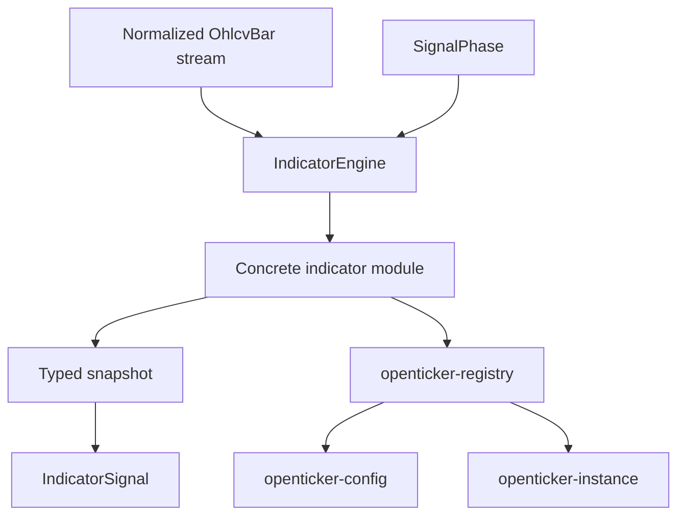

# ARCHITECTURE

Last reviewed: 2026-04-18

## Role

`openticker-signals` is the pure indicator-computation crate.

It owns:

- the shared indicator engine contract
- manifest metadata for built-in indicators
- reusable time-series math helpers
- indicator-specific parameter, snapshot, and engine-state types
- lightweight indicator-evaluation logging helpers
- built-in indicator descriptors consumed by the cross-crate registry

This crate does not own runtime orchestration. It produces deterministic indicator behavior over normalized bars.

## Entry Surface

Top-level public contract and helpers:

- `IndicatorEngine`
- `IndicatorEvaluation`
- `indicator_manifest(name)`
- `indicator_manifests()`
- `builtin_indicator_descriptors()`
- `IndicatorManifest`
- `IndicatorCapabilities`
- `IndicatorMarketSupport`
- `IndicatorWarmupRequirements`
- `log_indicator_evaluation(...)`

Concrete built-in indicators are exported from `src/lib.rs` through `src/indicators/mod.rs` and live under `src/indicators/`.

Representative examples:

- `StrongBuyStrongSellIndicator`
- `SniperV3Indicator`
- `MomentumUltimaPlusIndicator`
- `MomentumTrendPredictorIndicator`
- `DivergencesProIndicator`
- `MomentumWaveIndicator`
- `MomentumIndicator`
- `MomentumBalanceFinderIndicator`
- `MomentumLevelsV3Indicator`
- `ImpulseTargetsIndicator`
- `StructureProCoreIndicator`
- `InstitutionalAlgoCoreIndicator`
- `MomAlgo15Indicator`
- `AllInOneCoreIndicator`

## Internal Layout

| Path | Responsibility |
| --- | --- |
| `src/lib.rs` | Module wiring and public re-exports |
| `src/engine.rs` | Object-safe `IndicatorEngine` contract, `SignalSnapshot`, and evaluation/build/descriptor types |
| `src/common/` | Shared crate-internal helpers: rolling stats (`rolling.rs`), crossing predicates (`crossings.rs`), param parsing (`params.rs`) |
| `src/manifest.rs` | Built-in indicator metadata and capabilities |
| `src/observability.rs` | Actionable indicator-evaluation logging |
| `src/registry.rs` | Built-in indicator descriptor helpers |
| `src/indicators/mod.rs` | Indicator module index for built-ins |
| `src/indicators/*.rs` indicator modules | Params, snapshot, engine state, descriptors, validation, tests per indicator |

The current crate shape keeps contract/manifest/helpers at the crate root and groups built-in indicator modules under `src/indicators/`.

## Direct Dependency Wiring

Workspace dependencies:

| Crate | Used For |
| --- | --- |
| `openticker-core` | `OhlcvBar`, `SignalPhase`, `IndicatorSignal`, and indicator role/policy/stability enums |

This crate is intentionally pure and has no direct dependency on runtime, config, storage, HTTP, or connectors.

## Inbound Wiring

Primary consumers:

- `openticker-registry` aggregates built-in and optional extension descriptors for the current build
- `openticker-config` calls the full registry to validate configured indicators
- `openticker-instance` constructs boxed indicator engines through the full registry and drives them through `IndicatorEngine`
- `openticker-testkit` reuses concrete indicators for deterministic replay helpers

## Outbound Wiring

There is no outbound workspace orchestration from this crate.

Its only shared dependency is `openticker-core`.

## Evaluation Flow

At runtime, the effective shape is:

1. the build-specific registry chooses an indicator type by name
2. the registry constructs the corresponding concrete engine from descriptor metadata
3. runtime feeds each `OhlcvBar` plus `SignalPhase` into `IndicatorEngine::evaluate`
4. the concrete engine mutates internal state and derives a typed snapshot internally
5. runtime receives `IndicatorEvaluation` for downstream strategy logic and journaling

## Current Implementation Realities

- Built-in manifest metadata is descriptor-backed, so built-in metadata and built-in construction share one source of truth.
- Shared math is partially centralized in `src/common/`, but some indicator files still carry local helper implementations.
- Several indicators are classified as filter or context components and currently do not emit actionable signals.
- The contract stays pure, but engines are expected to be cloneable and deterministic because preview evaluation may run on cloned state.
- `log_indicator_evaluation(...)` is the bridge between pure indicator logic and operator-visible traceability.

## Practical Wiring Notes

- Adding a built-in indicator here is enough to make it visible to the build-specific registry, but private extension indicators live in `openticker-indicators` and are aggregated separately.
- A deployable indicator still may need config validation updates in `openticker-config` if it introduces new rules or parameters.

## Diagram

