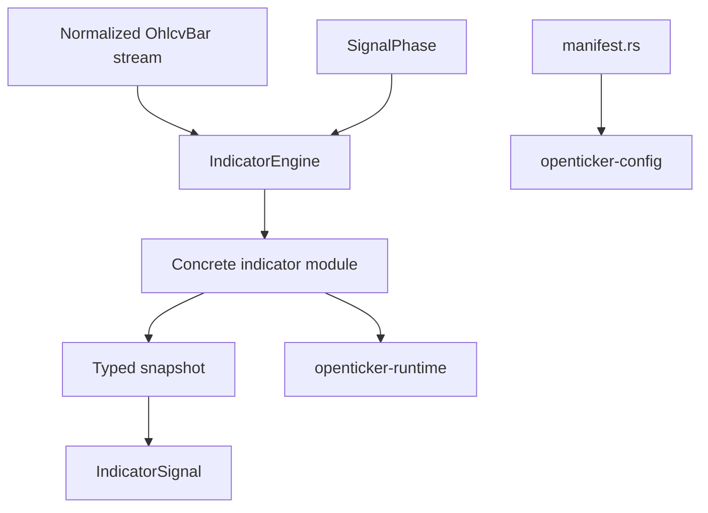

# ARCHITECTURE

Last reviewed: 2026-04-18

## Role

`openticker-signals` is the pure indicator-computation crate.

It owns:

- the shared indicator engine contract
- manifest metadata for built-in indicators
- reusable time-series math helpers
- indicator-specific parameter, snapshot, and engine-state types
- lightweight indicator-evaluation logging helpers

This crate does not own runtime orchestration. It produces deterministic indicator behavior over normalized bars.

## Entry Surface

Top-level public contract and helpers:

- `IndicatorEngine`
- `indicator_manifest(name)`
- `indicator_manifests()`
- `IndicatorManifest`
- `IndicatorCapabilities`
- `IndicatorMarketSupport`
- `IndicatorWarmupRequirements`
- `log_indicator_evaluation(...)`

Concrete built-in indicators are exported from `src/lib.rs` through `src/signals/mod.rs` and live under `src/signals/`.

Representative examples:

- `StrongBuyStrongSellIndicator`
- `SniperV3Indicator`
- `MomentumUltimaPlusIndicator`
- `MomentumTrendPredictorIndicator`
- `DivergencesProIndicator`
- `MomentumWaveIndicator`
- `MomentumIndicator`
- `MomentumBalanceFinderIndicator`
- `MomentumLevelsV3Indicator`
- `ImpulseTargetsIndicator`
- `StructureProCoreIndicator`
- `InstitutionalAlgoCoreIndicator`
- `MomAlgo15Indicator`
- `AllInOneCoreIndicator`

## Internal Layout

| Path | Responsibility |
| --- | --- |
| `src/lib.rs` | Public exports and the `IndicatorEngine` trait |
| `src/common.rs` | Shared math and series helpers |
| `src/manifest.rs` | Built-in indicator metadata and capabilities |
| `src/observability.rs` | Actionable indicator-evaluation logging |
| `src/signals/mod.rs` | Signal module index for built-ins |
| `src/signals/*.rs` indicator modules | Params, snapshot, engine state, validation, tests per indicator |

The current crate shape keeps contract/manifest/helpers at the crate root and groups indicator modules under `src/signals/`.

## Direct Dependency Wiring

Workspace dependencies:

| Crate | Used For |
| --- | --- |
| `openticker-core` | `OhlcvBar`, `SignalPhase`, `IndicatorSignal`, and indicator role/policy/stability enums |

This crate is intentionally pure and has no direct dependency on runtime, config, storage, HTTP, or connectors.

## Inbound Wiring

Primary consumers:

- `openticker-config` calls `indicator_manifest(...)` to validate configured indicators
- `openticker-runtime` manually constructs concrete indicator engines and drives them through `IndicatorEngine`
- `openticker-testkit` reuses concrete indicators for deterministic replay helpers

## Outbound Wiring

There is no outbound workspace orchestration from this crate.

Its only shared dependency is `openticker-core`.

## Evaluation Flow

At runtime, the effective shape is:

1. runtime chooses an indicator type by name
2. runtime manually constructs the corresponding concrete engine
3. runtime feeds each `OhlcvBar` plus `SignalPhase` into `IndicatorEngine::update`
4. the concrete engine mutates internal state and returns a typed snapshot
5. runtime extracts `IndicatorSignal` and snapshot metadata for downstream strategy logic and journaling

## Current Implementation Realities

- Manifest metadata is richer than runtime construction. `manifest.rs` and `openticker-runtime::build_runtime_indicator_engine` are still separate sources of truth.
- Shared math is partially centralized in `common.rs`, but some indicator files still carry local helper implementations.
- Several indicators are classified as filter or context components and currently do not emit actionable signals.
- The contract stays pure, but engines are expected to be cloneable and deterministic because preview evaluation may run on cloned state.
- `log_indicator_evaluation(...)` is the bridge between pure indicator logic and operator-visible traceability.

## Practical Wiring Notes

- Adding an indicator here is not enough to make it deployable.
- A deployable indicator also needs:
  - manifest metadata in this crate
  - config validation support in `openticker-config`
  - runtime factory wiring in `openticker-runtime`

## Diagram

