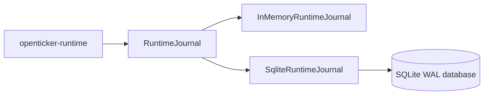

# ARCHITECTURE

Last reviewed: 2026-04-18

## Role

`openticker-storage` is the runtime journal and persistence layer.

It is responsible for:

- durable audit history
- restart-state persistence
- consistent readback of prior runtime decisions
- a shared journal contract with interchangeable backends

Current persisted families include:

- runtime events
- signals
- intents
- risk decisions
- orders
- fills
- positions
- reconciliation records
- bot events
- service events
- bot snapshots

## Entry Surface

Important public types:

- `RuntimeJournal`
- `InMemoryRuntimeJournal`
- `SqliteRuntimeJournal`
- `StorageError`

Important record and write families:

- `RuntimeEvent` / `EventWrite`
- `SignalRecord` / `SignalWrite`
- `IntentRecord` / `IntentWrite`
- `RiskDecisionRecord` / `RiskDecisionWrite`
- `OrderRecord` / `OrderWrite`
- `FillRecord` / `FillWrite`
- `PositionRecord` / `PositionWrite`
- `ReconciliationRecord` / `ReconciliationWrite`
- `BotEventRecord` / `BotEventWrite`
- `ServiceEventRecord` / `ServiceEventWrite`
- `BotSnapshot` / `BotSnapshotWrite`

Important backend entrypoints:

- `SqliteRuntimeJournal::open(...)`
- `SqliteRuntimeJournal::path()`

## Internal Layout

The crate is implemented across small focused modules.

| Path | Responsibility |
| --- | --- |
| `src/lib.rs` | Module tree and public re-exports |
| `src/records.rs` | Persisted record and write models |
| `src/journal.rs` | `RuntimeJournal` trait |
| `src/error.rs` | `StorageError` |
| `src/support.rs` | Shared mutex and clock helpers |
| `src/in_memory.rs` | In-memory journal struct and `RuntimeJournal` implementation |
| `src/sqlite/mod.rs` | SQLite journal struct and connection-pool management |
| `src/sqlite/journal.rs` | SQLite `RuntimeJournal` implementation and pruning helpers |
| `src/sqlite/migrations.rs` | Embedded schema initialization and schema-version enforcement |
| `src/operator_read_models.rs` | Projected in-memory operator read models |
| `src/tests/` | Backend unit tests and shared fixtures |

Logical sections:

1. persisted record and write structs
2. `RuntimeJournal` trait
3. backend structs (`InMemoryRuntimeJournal`, `SqliteRuntimeJournal`)
4. backend implementation modules
5. error type
6. tests

## Direct Dependency Wiring

This crate has no workspace-crate dependencies.

It is intentionally isolated so it can act as a shared persistence substrate for runtime without depending on runtime, connectors, or HTTP types.

## Inbound Wiring

Primary consumer:

- `openticker-runtime`

Runtime chooses a backend at boot:

- `InMemoryRuntimeJournal` for ephemeral mode
- `SqliteRuntimeJournal` for persistent mode

Runtime then uses the journal throughout lifecycle handling, signal processing, execution, reconciliation, and restart recovery.

## Outbound Wiring

This crate does not call into other workspace crates.

Its records are consumed indirectly by:

- `openticker-runtime` read APIs
- `openticker-http` journal endpoints through runtime
- `openticker-cli` via HTTP-driven operator views

## Backend Shape

### In-memory backend

- mirrors the journal trait using mutex-protected collections
- intended for tests and non-persistent runs

### SQLite backend

- uses one WAL-enabled SQLite connection behind a mutex
- delegates schema initialization and schema-version checks to `src/sqlite/migrations.rs`
- mirrors the same trait contract as the in-memory backend

## Current Implementation Realities

- The crate now separates shared types, in-memory backend, SQLite backend, and tests into dedicated modules.
- Backend implementation modules are still large and can be split further by record family over time.
- SQLite schema compatibility is enforced with `PRAGMA user_version`; incompatible versions are rejected rather than migrated in place.
- Order and fill insertion are explicitly idempotent in both backends.
- Bot snapshots are true upserts and are central to runtime restart behavior.
- Because the two backends mirror the same trait manually, partial changes are risky unless both are updated together.

## Practical Wiring Notes

- Storage is the audit and recovery substrate for `openticker-runtime`.
- Any record-shape change usually requires coordinated updates in:
  - runtime write paths
  - runtime read APIs
  - HTTP serialization surfaces
  - operator expectations in CLI and dashboard

## Diagram

