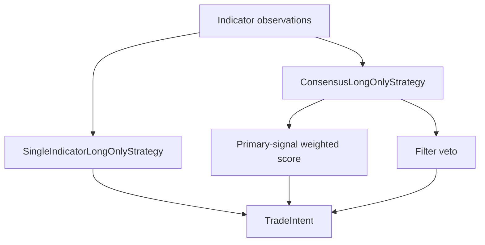

# ARCHITECTURE

Last reviewed: 2026-04-18

## Role

`openticker-strategy` maps indicator output into normalized trade intents.

It is intentionally small and policy-focused. It does not own:

- execution routing
- persistence
- cooldown state storage
- connector behavior
- risk evaluation

Current scope is long-only spot intent mapping.

## Entry Surface

Important public types:

- `StrategyContext`
- `Strategy`
- `IndicatorObservation<'a>`
- `ConsensusStrategyContext<'a>`
- `ConsensusStrategy`
- `SingleIndicatorLongOnlyStrategy`
- `ConsensusLongOnlyStrategy`

Important behavior:

- `SingleIndicatorLongOnlyStrategy::decide(...)`
- `ConsensusLongOnlyStrategy::decide_consensus(...)`

## Internal Layout

The crate is split into focused modules.

| Path | Responsibility |
| --- | --- |
| `src/lib.rs` | Module wiring and public re-exports |
| `src/context.rs` | `StrategyContext`, `IndicatorObservation`, `ConsensusStrategyContext` |
| `src/decision.rs` | `StrategyDecision` |
| `src/traits.rs` | `Strategy`, `ConsensusStrategy` traits |
| `src/single_indicator.rs` | `SingleIndicatorLongOnlyStrategy` behavior |
| `src/consensus.rs` | `ConsensusLongOnlyStrategy` behavior |
| `src/metadata.rs` | Shared metadata gating helpers |
| `src/tests.rs` | Unit tests |

Logical sections:

1. shared input context and decision contracts
2. single-indicator long-only implementation
3. consensus long-only implementation
4. shared metadata gating behavior
5. unit tests

## Direct Dependency Wiring

Workspace dependencies:

| Crate | Used For |
| --- | --- |
| `openticker-core` | `IndicatorRole`, `IndicatorSignal`, `IndicatorSignalPolicy`, `TradeIntent` |

This crate has no direct dependency on runtime, config, connectors, storage, or risk.

## Inbound Wiring

Primary consumer:

- `openticker-runtime`

Runtime currently chooses the strategy manually with string-based selection and then feeds either:

- a representative single signal
- or a list of weighted indicator observations for consensus evaluation

## Outbound Wiring

There is no outbound workspace wiring from this crate.

It returns `TradeIntent` to runtime and stops there.

## Decision Flow

### Single-indicator flow

1. receive current `IndicatorSignal`
2. check preview-policy rules through `StrategyContext`
3. map bullish signals to open/add intents
4. map bearish signals to close intents
5. otherwise emit `NoOp`

### Consensus flow

1. inspect each `IndicatorObservation`
2. use `PrimarySignal` observations for weighted scoring
3. use `Filter` observations as veto gates
4. ignore unsupported roles for scoring
5. derive a direction only if threshold and veto rules allow it
6. map that direction into a long-only `TradeIntent`

## Current Implementation Realities

- The crate is intentionally tiny and runtime-agnostic.
- Only two strategies exist today.
- Consensus logic only scores `PrimarySignal` roles and only uses `Filter` roles as vetoes.
- `Context`, `RiskHelper`, and `ResearchOnly` observations are currently non-participating in consensus scoring.
- Long-only mapping never emits `ReduceLong` even though the shared enum exists in `openticker-core`.
- Runtime selection is still string-based and lives in `openticker-runtime`, not here.

## Practical Wiring Notes

- This crate is the policy boundary between signal interpretation and risk/execution.
- If a new strategy is added here, runtime must still be updated to construct and invoke it.
- Changes here often alter behavior without changing any outer API shape, so runtime integration tests matter.

## Diagram

