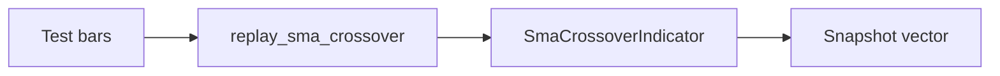

# ARCHITECTURE

Last reviewed: 2026-06-10

## Role

`openticker-testkit` is the reusable deterministic test-helper crate.

Its scope is intentionally small today. It does not try to be a full simulation framework.

Current responsibilities are:

- explicit replay helpers for indicator tests
- simple bar-construction helpers for test setup
- deterministic config-bundle fixtures for runtime-style tests
- a deterministic fake reconciliation HTTP server for connector-style tests

## Entry Surface

Current public helpers:

- `close_only_bar(...)`
- `close_only_symbol_bar(...)`
- `replay_sma_crossover(...)`
- `shared_fixture_bundle(...)`
- `shared_fixture_bundle_for_symbol(...)`
- `spawn_fake_reconciliation_server(...)`

`replay_sma_crossover(...)`:

- constructs an `SmaCrossoverIndicator`
- replays a slice of `OhlcvBar` values
- applies a chosen `SignalPhase`
- returns the collected indicator snapshots

`close_only_bar(...)` creates a simple deterministic OHLCV bar for tests.

`close_only_symbol_bar(...)` returns a deterministic `(symbol, bar)` pair built on `close_only_bar(...)`.

`shared_fixture_bundle(...)` and `shared_fixture_bundle_for_symbol(...)` build a deterministic single-instance paper `ConfigBundle`.

`spawn_fake_reconciliation_server(...)` serves canned JSON bodies for `GET /v2/orders`, `GET /v2/positions`, and `GET /v2/account`, then returns the observed request lines.

## Internal Layout

The crate keeps a small public entry in `src/lib.rs` and splits implementation files by concern.

| Path | Responsibility |
| --- | --- |
| `src/lib.rs` | Module wiring and public re-exports |
| `src/bundle.rs` | Deterministic `ConfigBundle` fixture implementation |
| `src/fixtures.rs` | Bar helper implementation |
| `src/reconciliation_server.rs` | Fake reconciliation HTTP server implementation |
| `src/replay.rs` | Replay helper implementation |

## Direct Dependency Wiring

Workspace dependencies:

| Crate | Used For |
| --- | --- |
| `chrono` | RFC3339 timestamp parsing in bar fixtures |
| `openticker-config` | `ConfigBundle` and its section types |
| `openticker-core` | core domain types (`OhlcvBar`, `SignalPhase`, `Timeframe`, `ExecutionMode`, `MarketType`, metadata filters) |
| `openticker-signals` | the `IndicatorEngine` contract and concrete `sma_crossover` types |
| `toml` | empty `toml::Table` indicator params in bundle fixtures |

## Inbound Wiring

Primary consumer today:

- `openticker-runtime` integration tests

The crate is meant to be reusable across other workspace tests as deterministic helpers expand.

## Outbound Wiring

This crate only reaches outward to:

- `openticker-core`
- `openticker-config`
- `openticker-signals`

It has no dependency on runtime internals, storage, HTTP, or connectors.

## Replay Flow

Current replay helper flow is:

1. construct a concrete indicator
2. iterate through a provided slice of bars
3. call `IndicatorEngine::update(...)` for each bar and phase
4. collect snapshots into a vector
5. return the snapshots to the caller for assertions

## Current Implementation Realities

- The crate is still highly specific rather than generalized.
- The public surface is intentionally tiny: six targeted helpers across replay, bar fixtures, config bundles, and a fake reconciliation server.
- This is not yet a multi-indicator replay harness or broad fake-runtime framework.
- Its value comes from staying explicit and deterministic rather than abstract and generic.

## Practical Wiring Notes

- New helpers should remain small and targeted.
- Production logic should not be moved here simply because tests need it.
- Reuse should happen through real workspace contracts, not copied test-only equivalents.

## Diagram

